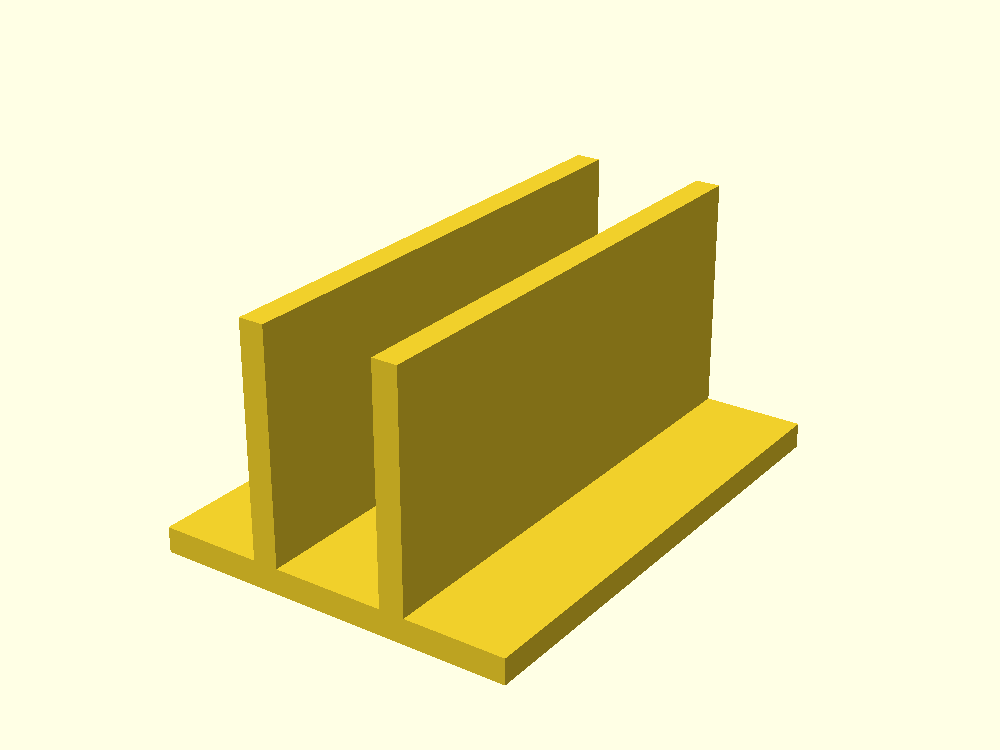

# Vertical laptop stand

A single-piece stand for a closed laptop or MacBook, rebuilt parametrically in
OpenSCAD. Two parallel wings hold the laptop above a flat base with supporting
feet on both sides. No imported meshes or external SCAD libraries are needed.



Open `stand.scad` and use the Customizer or edit the variables at the top.
Dimensions are in millimetres; angles are in degrees.

| Parameter | Default | Meaning |
| --- | ---: | --- |
| `height` | 45 | Vertical coverage above the slot floor; excludes base thickness. |
| `width` | 22 | Clear distance **perpendicular** to the wings, including any clearance/padding. |
| `length` | 100 | Size along the laptop's bottom edge. |
| `foot_width` | 20 | Horizontal extension beyond the outermost wing projection on each side. |
| `inclination` | 90 | Wing angle to the desk: 90° upright; 60–89° lean toward +X; 91–120° toward −X. |
| `wing_thickness` | 5 | Wall thickness perpendicular to the wing. |
| `base_thickness` | 5 | Thickness below the laptop. |

Both wings incline **in the same direction**, keeping the slot parallel and the
specified fit unchanged. Inclination does not flare the opening. `height` stays
vertical, so inclined wings are longer. The base expands to contain their full
horizontal projection plus `foot_width` on both sides. At the defaults the stand
is 72 × 100 × 50 mm (X × Y × Z).


Measure the closed laptop where the stand will grip it. Set `width` to that
thickness plus your desired fit clearance and the combined thickness of any
felt/TPU liners. Print a short section first (for example `length = 15`) to check
fit before printing the full stand. Default dimensions are a starting point,
not a model-specific MacBook fit guarantee.

## Rendering

Use F6 then export STL, or render from the command line:

```sh
openscad -o /tmp/laptop_stand.stl laptop_stand/stand.scad
openscad -o /tmp/laptop_stand_75.stl \
  -D 'height=55' -D 'width=24' -D 'length=120' \
  -D 'foot_width=25' -D 'inclination=75' laptop_stand/stand.scad
```

The model is oriented with its flat base on Z=0 for printing. Start with 3–4
perimeters and a small fit sample; choose material and infill for the laptop's
weight and operating temperature. Inclined wings introduce overhangs, so check
the slicer preview. Larger feet improve lateral support, but stability also
depends on laptop size, weight, tilt, and placement along its bottom edge.
This design has been rendered, not physically load-tested.

## Attribution and license

Inspired by [Vertical Laptop Stand – Minimalist and Durable by tacaa](https://www.thingiverse.com/thing:6851927),
published under [Creative Commons Attribution-ShareAlike 4.0](https://creativecommons.org/licenses/by-sa/4.0/).
This adaptation replaces the fixed-size model with an original OpenSCAD profile
and exposes dimensions and parallel wing inclination. Files in this folder are
likewise licensed **CC BY-SA 4.0**, overriding the repository's default license
for this folder.
