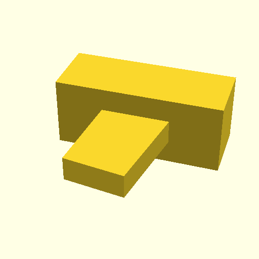

# Monsieur Cuisine Cup Fix

Two small OpenSCAD repair tries for the Monsieur Cuisine cup sensor tab.

## Attempts

- `cup_fix.scad`: replacement leg extension with a straight top sleeve, meant to be glued to the shortened or broken cup leg.
- `reverse_fix.scad`: small 12x8x5 mm block to fill the sensor click area, so the shorter existing leg can still press the switch.

